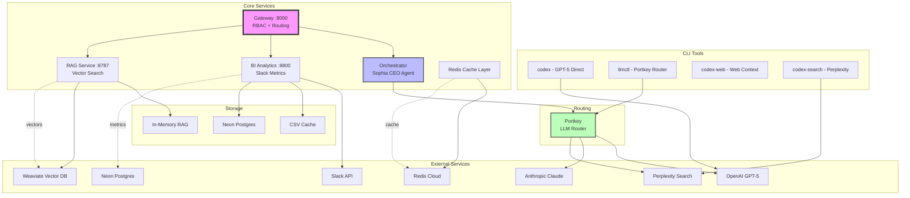

# PayReady AI Architecture Outline

## Project Structure

### 1. **Core Configuration Files**
- **`/pyproject.toml`** - Python project configuration
  - Dependencies: FastAPI, uvicorn, pandas, milvus-lite, psycopg, langgraph, agentops, redis
  - Python 3.12 requirement
  - Project metadata

- **`/.pre-commit-config.yaml`** - Code quality hooks
  - Trailing whitespace removal
  - End-of-file fixes
  - Large file checks
  - Ruff linting

### 2. **Environment Configuration** (`~/.config/payready/`)
- **`env.base`** - Basic settings (timezone, log level)
- **`env.llm`** - LLM routing keys
  - Portkey API key
  - Virtual keys for 10+ providers (OpenAI, Anthropic, XAI, Perplexity, etc.)
- **`env.rag`** - Vector database settings
  - Milvus configuration
  - Weaviate cloud credentials
  - Mem0 memory API
- **`env.agno`** - Agent orchestration
  - Agno API key
  - Redis cloud connection
  - Neon Postgres credentials
  - AgentOps monitoring
- **`env.biz`** - Business systems (Slack for BI only)
- **`env.platform`** - Platform services
  - N8N workflow automation
  - Neo4j graph database
  - Pulumi infrastructure

### 3. **CLI Tools** (`/bin/`)
- **`codex`** - GPT-5 model wrapper
  - Supports gpt-5-mini, gpt-5, gpt-5-nano
  - Temperature control
  - Model selection
- **`codex-web`** - Simulated web context
- **`codex-search`** - Real web search via Perplexity
- **`gpt5`** - Direct gpt-5-mini wrapper
- **`llmctl`** - Portkey routing controller
  - Routes: coding, reasoning, fast, search, deep, stream
- **`test-models.sh`** - Model testing suite
- **`portkey.routes.json`** - Route configuration

### 4. **Gateway Service** (`/gateway/`)
- **`main.py`** - FastAPI gateway with RBAC
  - Port 8000
  - Role-based access control
  - Domain routing (BI, orchestrator, domains)
  - Health checks

### 5. **Orchestrator** (`/orchestrator/`)
- **`sophia.py`** - Full orchestrator with LangGraph
  - CEO persona implementation
  - SwarmOS integration
  - RBAC-gated access
- **`sophia_simple.py`** - Simplified orchestrator
  - Basic agentic workflow
  - Direct LLM integration

### 6. **Local RAG Service** (`/local_rag/`)
- **`api.py`** - FastAPI RAG API (port 8787)
  - Query endpoint
  - Index management
  - Label filtering
- **`basic_index.py`** - In-memory vector storage
  - Sentence transformers embeddings
  - Cosine similarity search
- **`weaviate_index.py`** - Weaviate cloud integration
  - Cloud vector database
  - Advanced filtering
- **`simple_index.py`** - Simplified RAG implementation
- **`index.py`** - Main RAG interface

### 7. **Services** (`/services/`)

#### **Cache Service**
- **`cache.py`** - Redis caching layer
  - Cloud Redis connection
  - TTL management
  - Get/set/delete operations
  - Compute-or-cache pattern

#### **Connectors** (`/connectors/`)
- **`slack.py`** - Slack connector (BI only)
  - Read-only operations
  - Channel listing
  - Message counting
  - NO MCP/coding hooks
- **`apollo.py`** - Apollo.io integration
  - Sales intelligence
  - Contact enrichment

#### **Domain Services** (`/domains/bi/`)
- **`slack_analytics.py`** - BI analytics
  - CSV caching
  - Neon Postgres sink
  - Channel activity tracking
  - Port 8800

### 8. **Tools** (`/tools/`)
- **`agent_dup_check.py`** - Agent deduplication

### 9. **Policies** (`/policies/rbac/`)
- **`roles.yaml`** - RBAC configuration
  - CEO: full access
  - Leadership: bi:read, orchestrator:execute
  - Sales: domains:sales:*
  - Engineering: domains:dev:*
  - Finance: bi:read

### 10. **Data** (`/data/`)
- **`rag_cache.json`** - Local RAG cache
- **`bi_slack_cache.csv`** - Slack metrics cache

## Mermaid Architecture Diagram

## Key Design Decisions

1. **Strict Slack Separation**: Slack API is used ONLY for BI analytics, never connected to coding MCPs or development tools

2. **Multi-Model Strategy**:
   - GPT-5 family for coding tasks
   - Claude for reasoning
   - Perplexity for web search
   - Specialized models via Portkey routing

3. **Layered Architecture**:
   - Gateway layer for RBAC enforcement
   - Service layer for domain logic
   - Connector layer for external integrations
   - Cache layer for performance

4. **Phase-0 Approach**:
   - Speed over security
   - Local development focus
   - All services on localhost
   - CSV fallbacks for persistence

## Service Ports
- 8000: Gateway (RBAC + routing)
- 8800: BI Analytics (Slack insights)
- 8787: RAG Service (vector search)
- 7777: Agno (future)

## Technology Stack
- **Language**: Python 3.12
- **Framework**: FastAPI
- **Vector DB**: Milvus Lite / Weaviate Cloud
- **Cache**: Redis Cloud
- **Analytics DB**: Neon Postgres
- **Orchestration**: LangGraph
- **Monitoring**: AgentOps
- **LLM Routing**: Portkey