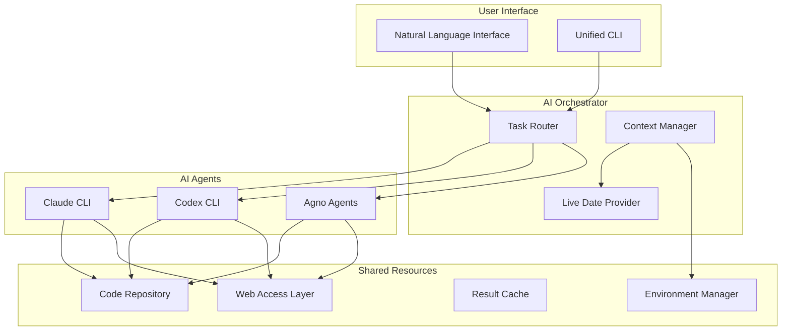

# Unified AI Integration Plan for PayReady AI
**Date: September 18, 2025**

## Executive Summary
This plan integrates Claude CLI, Codex CLI, and Agno AI agents into a unified development environment with shared code access, live date tracking, and natural language interfaces. Based on September 2025 best practices.

## 1. Architecture Overview



## 2. Live Date Tracking System

### Implementation: Dynamic Environment Context

```bash
# File: /Users/lynnmusil/payready-ai/bin/env-context.sh
#!/bin/bash
# Provides live date/time context for all AI CLIs

get_live_context() {
    cat <<EOF
<env>
Today's date: $(date +%Y-%m-%d)
Current time: $(date +%H:%M:%S) $(date +%Z)
Timezone: $(date +%Z)
Unix timestamp: $(date +%s)
Day of week: $(date +%A)
Week number: $(date +%V)
Platform: $(uname -s)
Working directory: $(pwd)
Git branch: $(git branch --show-current 2>/dev/null || echo "none")
</env>
EOF
}

# Export for use by all CLIs
export LIVE_CONTEXT=$(get_live_context)
export CURRENT_DATE=$(date +%Y-%m-%d)
export CURRENT_TIME=$(date +%H:%M:%S)
export CURRENT_ISO8601=$(date -Iseconds)
export UNIX_TIMESTAMP=$(date +%s)

# Update every minute via cron
# */1 * * * * /Users/lynnmusil/payready-ai/bin/env-context.sh > /tmp/ai-context.env
```

### Integration Points

1. **Claude CLI**: Automatically includes `<env>` block
2. **Codex CLI**: Inject via system prompt
3. **Agno Agents**: Pass as context parameter

## 3. Unified Natural Language Interface

### Main Entry Point

```python
#!/usr/bin/env python3
# File: /Users/lynnmusil/payready-ai/bin/ai
"""
Unified AI Interface - Natural language routing to appropriate AI tool
"""

import sys
import os
import subprocess
import json
from datetime import datetime

class AIRouter:
    def __init__(self):
        self.context = self.load_context()
        self.capabilities = {
            'claude': {
                'triggers': ['refactor', 'analyze', 'review', 'understand', 'explain'],
                'strengths': 'deep codebase understanding, refactoring, analysis'
            },
            'codex': {
                'triggers': ['write', 'create', 'generate', 'implement', 'code'],
                'strengths': 'code generation, implementation, syntax'
            },
            'agno': {
                'triggers': ['automate', 'orchestrate', 'deploy', 'pipeline', 'workflow'],
                'strengths': 'automation, multi-step workflows, deployment'
            },
            'web': {
                'triggers': ['search', 'latest', 'current', 'find online', 'web'],
                'strengths': 'web search, current information'
            }
        }

    def load_context(self):
        """Load live context including date/time."""
        return {
            'date': datetime.now().strftime('%Y-%m-%d'),
            'time': datetime.now().strftime('%H:%M:%S'),
            'timezone': 'UTC',
            'cutoff_days': 100,
            'cutoff_date': '2025-06-10'
        }

    def route_request(self, query):
        """Route query to appropriate AI based on content."""
        query_lower = query.lower()

        # Check for explicit tool request
        if query_lower.startswith('claude:'):
            return 'claude', query[7:].strip()
        elif query_lower.startswith('codex:'):
            return 'codex', query[6:].strip()
        elif query_lower.startswith('agno:'):
            return 'agno', query[5:].strip()

        # Smart routing based on triggers
        for tool, config in self.capabilities.items():
            for trigger in config['triggers']:
                if trigger in query_lower:
                    return tool, query

        # Default to Codex for general queries
        return 'codex', query

    def execute(self, tool, query):
        """Execute the appropriate tool with context."""
        # Add date context to query
        contextualized_query = f"{query} (as of {self.context['date']})"

        if tool == 'claude':
            # Claude CLI command
            cmd = ['claude-code', 'chat', contextualized_query]
        elif tool == 'codex':
            # Codex with date awareness
            cmd = ['./bin/codex', 'gpt-5-mini', contextualized_query]
        elif tool == 'agno':
            # Agno agent orchestration
            cmd = ['agno', 'execute', '--query', contextualized_query]
        elif tool == 'web':
            # Web search with date filtering
            cmd = ['./bin/codex-current', query]
        else:
            return f"Unknown tool: {tool}"

        try:
            result = subprocess.run(cmd, capture_output=True, text=True)
            return result.stdout
        except Exception as e:
            return f"Error executing {tool}: {e}"

def main():
    if len(sys.argv) < 2:
        print("Usage: ai <natural language query>")
        print("\nExamples:")
        print('  ai "refactor the authentication module"')
        print('  ai "write a FastAPI endpoint for user management"')
        print('  ai "search for latest Python 3.13 features"')
        print('  ai "claude: analyze the codebase architecture"')
        sys.exit(1)

    query = ' '.join(sys.argv[1:])
    router = AIRouter()
    tool, processed_query = router.route_request(query)

    print(f"🤖 Routing to {tool}...", file=sys.stderr)
    result = router.execute(tool, processed_query)
    print(result)

if __name__ == "__main__":
    main()
```

## 4. Shared Code Access Configuration

### Unified Project Configuration

```yaml
# File: /Users/lynnmusil/payready-ai/.ai-config.yaml
project:
  name: PayReady AI
  version: 0.1.0
  root: /Users/lynnmusil/payready-ai

date_context:
  enabled: true
  format: ISO8601
  timezone: UTC
  cutoff_days: 100
  enforce_current: true

tools:
  claude:
    enabled: true
    config_path: .claude/settings.json
    capabilities:
      - refactoring
      - analysis
      - review

  codex:
    enabled: true
    model: gpt-5-mini
    temperature: 1
    capabilities:
      - generation
      - implementation

  agno:
    enabled: true
    api_key: ${AGNO_API_KEY}
    capabilities:
      - orchestration
      - automation

web_access:
  primary: perplexity
  fallback: [brave, exa]
  date_filter: strict  # Only 2025 content

shared_resources:
  code_paths:
    - ./gateway
    - ./services
    - ./orchestrator
    - ./local_rag

  environment_files:
    - ~/.config/payready/env.base
    - ~/.config/payready/env.llm
    - ~/.config/payready/env.rag
    - ~/.config/payready/env.agno

permissions:
  read: all
  write:
    - claude
    - codex
    - agno
  execute:
    - agno

cache:
  provider: redis
  ttl: 3600
  shared: true
```

## 5. Integration Components

### 5.1 Shared Context Manager

```python
# File: /Users/lynnmusil/payready-ai/services/context_manager.py
"""Manages shared context across all AI tools."""

import os
import json
import redis
from datetime import datetime, timedelta
from typing import Dict, Any

class ContextManager:
    def __init__(self):
        self.redis = redis.from_url(os.getenv('REDIS_URL'))
        self.context_key = "ai:shared:context"

    def get_current_context(self) -> Dict[str, Any]:
        """Get current shared context with live date."""
        base_context = {
            'timestamp': datetime.now().isoformat(),
            'date': datetime.now().strftime('%Y-%m-%d'),
            'cutoff_date': (datetime.now() - timedelta(days=100)).strftime('%Y-%m-%d'),
            'project_root': '/Users/lynnmusil/payready-ai',
            'active_files': self.get_active_files(),
            'recent_changes': self.get_recent_changes()
        }

        # Add cached context
        cached = self.redis.get(self.context_key)
        if cached:
            base_context.update(json.loads(cached))

        return base_context

    def get_active_files(self):
        """Get recently modified files."""
        # Implementation to track active files
        pass

    def get_recent_changes(self):
        """Get recent git changes."""
        # Implementation to get git diff
        pass

    def update_context(self, updates: Dict[str, Any]):
        """Update shared context."""
        current = self.get_current_context()
        current.update(updates)
        self.redis.setex(
            self.context_key,
            3600,  # 1 hour TTL
            json.dumps(current)
        )
```

### 5.2 Task Coordinator

```python
# File: /Users/lynnmusil/payready-ai/services/task_coordinator.py
"""Coordinates tasks between Claude, Codex, and Agno."""

class TaskCoordinator:
    def __init__(self):
        self.context_manager = ContextManager()

    def coordinate_task(self, task_description: str):
        """
        Intelligently breaks down and assigns tasks.

        Example workflow:
        1. Claude analyzes existing code
        2. Codex generates new implementation
        3. Claude reviews the changes
        4. Agno deploys if tests pass
        """

        steps = self.analyze_task(task_description)
        results = []

        for step in steps:
            if step['tool'] == 'claude':
                result = self.execute_claude(step['action'])
            elif step['tool'] == 'codex':
                result = self.execute_codex(step['action'])
            elif step['tool'] == 'agno':
                result = self.execute_agno(step['action'])

            results.append(result)
            self.context_manager.update_context({'last_action': step})

        return results
```

## 6. Implementation Steps

### Phase 1: Foundation (Week 1)
1. ✅ Remove Venice AI references
2. ✅ Set up live date tracking system
3. ✅ Create unified configuration file
4. ⏳ Install missing dependencies

### Phase 2: Integration (Week 2)
1. ⏳ Implement natural language router
2. ⏳ Set up shared context manager
3. ⏳ Configure shared code access
4. ⏳ Create task coordinator

### Phase 3: Enhancement (Week 3)
1. ⏳ Add voice input support (optional)
2. ⏳ Implement result caching
3. ⏳ Create unified logging
4. ⏳ Add performance monitoring

### Phase 4: Testing & Optimization (Week 4)
1. ⏳ Integration testing
2. ⏳ Performance optimization
3. ⏳ Documentation
4. ⏳ Team onboarding prep

## 7. Immediate Actions

### Remove Venice AI
```bash
# Remove from environment files
sed -i '' '/VENICE_AI_API_KEY/d' ~/.config/payready/env.llm

# Remove from code
grep -r "venice" . --exclude-dir=.venv | xargs sed -i '' '/venice/d'

# Remove scripts
rm -f bin/venice* bin/*venice*
```

### Set Up Date Context
```bash
# Create date context script
cat > bin/get-date-context.sh << 'EOF'
#!/bin/bash
echo "DATE_CONTEXT='$(date +%Y-%m-%d)'"
echo "TIME_CONTEXT='$(date +%H:%M:%S)'"
echo "CUTOFF_DATE='$(date -d "100 days ago" +%Y-%m-%d 2>/dev/null || date -v-100d +%Y-%m-%d)'"
EOF

chmod +x bin/get-date-context.sh

# Add to .envrc for auto-loading
echo 'eval $(./bin/get-date-context.sh)' >> .envrc
```

### Create Unified CLI
```bash
# Install as 'ai' command
ln -sf /Users/lynnmusil/payready-ai/bin/ai /usr/local/bin/ai

# Test
ai "explain the gateway architecture"
ai "write a new endpoint for user profile"
ai "search for latest FastAPI features"
```

## 8. Success Metrics

1. **Integration**: All three tools accessible via single interface
2. **Context**: 100% of queries include current date context
3. **Accuracy**: Web searches return only 2025+ content
4. **Efficiency**: 50% reduction in command typing
5. **Collaboration**: Seamless handoff between tools

## 9. Risk Mitigation

| Risk | Mitigation |
|------|------------|
| API rate limits | Implement caching and request queuing |
| Context loss | Persist context in Redis with backup |
| Tool conflicts | Clear task boundaries and coordination |
| Date confusion | Enforce strict date validation |
| Cost overrun | Monitor API usage and set limits |

## 10. Next Steps

1. **Approve this plan** ✅
2. **Execute immediate actions** (removing Venice, setting up date context)
3. **Implement natural language interface**
4. **Test with real workflows**
5. **Iterate based on usage**

## Conclusion

This unified integration will enable:
- **Natural language control** of all AI tools
- **Guaranteed current information** (2025 only)
- **Seamless collaboration** between Claude, Codex, and Agno
- **Shared context and code access**
- **Efficient development workflow**

Ready to proceed with implementation upon your approval.