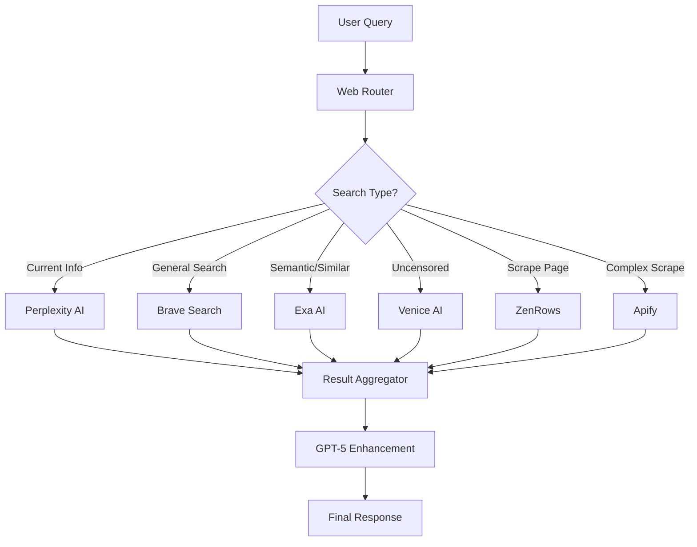

# Web Access Implementation Plan for PayReady AI

## Overview of Available APIs

### 1. **Perplexity AI** ✅ Configured
- **Purpose**: Real-time web search with citations
- **Best For**: Current information, news, documentation searches
- **Key Features**: Built-in web access, citations included
- **Status**: Working with `sonar` model

### 2. **Brave Search API**
- **Purpose**: Privacy-focused web search
- **Best For**: General web searches, news, current events
- **Key Features**: No tracking, clean results, fast response
- **Pricing**: Free tier available

### 3. **Exa AI**
- **Purpose**: Semantic neural search
- **Best For**: Finding similar content, research papers, technical documentation
- **Key Features**:
  - Embeddings-based search (understands meaning)
  - Similarity search by URL or text
  - Sub-425ms response time
  - Can process 1M+ results

### 4. **Venice AI**
- **Purpose**: Uncensored AI models
- **Best For**: Creative writing, controversial topics, unfiltered responses
- **Key Features**:
  - Privacy-first (no logging)
  - Multiple uncensored models
  - 256k token context window
  - Multimodal capabilities

### 5. **ZenRows**
- **Purpose**: Web scraping with anti-bot bypass
- **Best For**: Extracting data from protected sites, parsing JavaScript-heavy pages
- **Key Features**:
  - 55M+ rotating proxies
  - CAPTCHA solving
  - JavaScript rendering
  - 98.7% success rate

### 6. **Apify**
- **Purpose**: Web scraping actors and automation
- **Best For**: Complex scraping workflows, social media data, marketplace monitoring
- **Key Features**:
  - Pre-built actors for major sites
  - Headless browser automation
  - Scheduled scraping
  - Data storage

## Implementation Architecture



## Implementation Steps

### Phase 1: Core Web Search Router
Create a unified interface that intelligently routes queries to the best API.

### Phase 2: API-Specific Handlers
Implement specialized handlers for each API's unique capabilities.

### Phase 3: Result Aggregation
Combine results from multiple sources when needed.

### Phase 4: Caching Layer
Use Redis to cache results and reduce API costs.

## Use Case Matrix

| Use Case | Primary API | Fallback | Notes |
|----------|------------|----------|-------|
| Latest news/docs | Perplexity | Brave | Real-time with citations |
| Technical research | Exa | Perplexity | Semantic understanding |
| Creative/uncensored | Venice | - | No content restrictions |
| Data extraction | ZenRows | Apify | Anti-bot bypass |
| Social media data | Apify | ZenRows | Pre-built actors |
| General search | Brave | Perplexity | Privacy-first |
| Similar content | Exa | - | Embeddings-based |
| JavaScript sites | ZenRows | Apify | Headless browser |
| Bulk scraping | Apify | ZenRows | Scheduled jobs |

## CLI Commands Structure

```bash
# Unified web search
codex-web <query>                 # Auto-selects best API
codex-web --api=exa <query>       # Force specific API
codex-web --multi <query>         # Use multiple APIs

# Specialized commands
codex-news <query>                # Perplexity + Brave for news
codex-research <query>            # Exa for semantic search
codex-uncensored <query>          # Venice for unrestricted
codex-scrape <url>                # ZenRows for extraction
codex-monitor <url> --schedule    # Apify for monitoring

# Advanced options
codex-web --cache=1h <query>      # Cache for 1 hour
codex-web --follow-links <query>  # Deep search with link following
codex-web --aggregate <query>     # Combine multiple sources
```

## Testing Plan

### 1. Individual API Tests
- Test each API endpoint individually
- Verify authentication and basic functionality
- Document response times and formats

### 2. Router Logic Tests
- Verify correct API selection based on query type
- Test fallback mechanisms
- Validate error handling

### 3. Integration Tests
- Multi-API aggregation
- Cache hit/miss scenarios
- Rate limit handling

### 4. Performance Tests
- Response time benchmarks
- Concurrent request handling
- Memory usage under load

## Cost Optimization

1. **Smart Routing**: Use cheapest appropriate API
2. **Caching**: Redis cache with smart TTL
3. **Batch Processing**: Group similar requests
4. **Fallback Strategy**: Free tier → Paid tier
5. **Rate Limit Management**: Distribute across APIs

## Error Handling

```python
API_HIERARCHY = {
    'general': ['brave', 'perplexity', 'exa'],
    'scraping': ['zenrows', 'apify'],
    'uncensored': ['venice'],
    'semantic': ['exa', 'perplexity']
}

def get_with_fallback(query, category='general'):
    for api in API_HIERARCHY[category]:
        try:
            return call_api(api, query)
        except APIError:
            continue
    return "All APIs failed"
```

## Security Considerations

1. **API Key Management**: Store in env files, never commit
2. **Rate Limiting**: Implement per-API rate limits
3. **Input Validation**: Sanitize queries before sending
4. **Result Filtering**: Option to filter sensitive content
5. **Audit Logging**: Track API usage and costs

## Next Steps

1. Implement core router (`codex-web-router.py`)
2. Create API-specific modules
3. Add Redis caching layer
4. Build testing suite
5. Create usage documentation
6. Monitor and optimize based on usage patterns