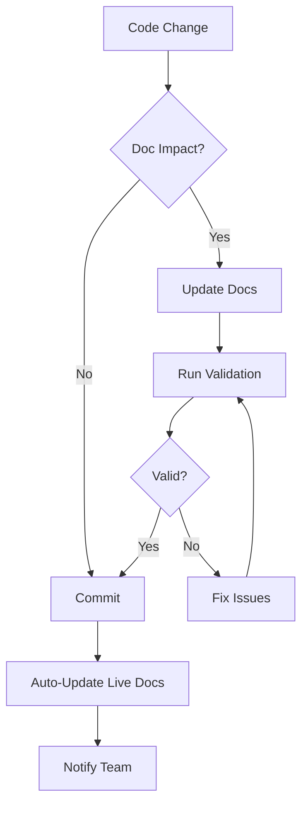

# PayReady AI Documentation System
**Last Updated**: September 18, 2025
**Version**: 2.1.0
**Repository**: https://github.com/ai-cherry/payready-ai
**Status**: Living Document

## Documentation Architecture

### 1. Document Categories & Naming Convention

```
docs/
├── ARCHITECTURE/           # System design & technical architecture
│   ├── SYSTEM_ARCHITECTURE.md
│   ├── AI_INTEGRATION_ARCHITECTURE.md
│   └── API_ARCHITECTURE.md
├── GUIDES/                 # How-to guides & tutorials
│   ├── SETUP_GUIDE.md
│   ├── DEVELOPMENT_GUIDE.md
│   └── DEPLOYMENT_GUIDE.md
├── REFERENCES/             # API docs, configuration references
│   ├── CLI_REFERENCE.md
│   ├── API_REFERENCE.md
│   └── CONFIG_REFERENCE.md
├── OPERATIONS/             # Live operational docs
│   ├── CURRENT_STATE.md    # Auto-updated system state
│   ├── ROADMAP.md          # Active development plans
│   └── CHANGELOG.md        # Version history
└── DECISIONS/              # Architecture Decision Records (ADRs)
    ├── ADR-001-unified-cli.md
    ├── ADR-002-date-filtering.md
    └── ADR-003-documentation-system.md
```

### 2. Living Document Principles

#### Auto-Updated Documents
These documents are automatically maintained by the system:

| Document | Update Trigger | Update Method |
|----------|---------------|---------------|
| `CURRENT_STATE.md` | Every commit | Git hook + context manager |
| `CHANGELOG.md` | Version tags | Automated changelog generator |
| `API_REFERENCE.md` | Code changes | OpenAPI/docstring extraction |
| `CLI_REFERENCE.md` | CLI updates | Help text extraction |

#### Version Control Integration
- **Main Branch**: Production documentation
- **Feature Branches**: Draft documentation updates
- **Pull Requests**: Documentation review required
- **Tags**: Version snapshots for releases

### 3. CLI Documentation Commands

```bash
# Documentation access via unified CLI
ai docs list                     # List all documentation
ai docs show SYSTEM_ARCHITECTURE # Display specific doc
ai docs search "web access"      # Search documentation
ai docs update                   # Trigger auto-update
ai docs validate                 # Check doc consistency
ai docs generate changelog       # Generate changelog from commits

# Quick access aliases
ai-docs                          # Interactive documentation browser
ai-architecture                  # Show architecture docs
ai-guide setup                   # Show setup guide
```

### 4. Document Management Workflow



### 5. Document Templates

#### Architecture Document Template
```markdown
# [Component] Architecture
**Version**: X.Y.Z
**Last Updated**: YYYY-MM-DD
**Author**: [Name/AI]
**Status**: [Draft|Review|Active|Deprecated]

## Overview
Brief description of the component

## Context
Why this architecture exists

## Design
Technical design details

## Implementation
Code examples and integration points

## Testing
How to test this component

## References
Related documents and external resources
```

#### Decision Record Template (ADR)
```markdown
# ADR-XXX: [Title]
**Date**: YYYY-MM-DD
**Status**: [Proposed|Accepted|Rejected|Superseded]
**Deciders**: [Names/Systems]

## Context
What prompted this decision

## Decision
What we decided

## Consequences
What happens as a result

## Alternatives Considered
Other options evaluated
```

### 6. Automation Scripts

#### Document Update Script
```python
#!/usr/bin/env python3
# File: docs/scripts/update_docs.py

import os
import json
import subprocess
from datetime import datetime
from pathlib import Path

class DocUpdater:
    def __init__(self):
        self.docs_path = Path('/Users/lynnmusil/payready-ai/docs')
        self.context_manager = get_context_manager()

    def update_current_state(self):
        """Update CURRENT_STATE.md with live system info."""
        context = self.context_manager.get_current_context()

        content = f"""# Current System State
**Last Updated**: {context['timestamp']}
**Auto-Generated**: Do not edit manually

## System Status
- **Date**: {context['date']}
- **Branch**: {context['git_status']['branch']}
- **Clean**: {context['git_status']['clean']}
- **Active Files**: {len(context['active_files'])}

## Recent Changes
{self._format_changes(context['recent_changes'])}

## Environment
- **Platform**: {context['environment']['platform']}
- **Python**: {context['environment']['python_version']}
- **Storage**: {context['environment']['storage_type']}
"""

        state_file = self.docs_path / 'OPERATIONS' / 'CURRENT_STATE.md'
        state_file.write_text(content)

    def generate_changelog(self):
        """Generate CHANGELOG.md from git commits."""
        # Implementation for changelog generation
        pass

    def validate_docs(self):
        """Validate documentation consistency."""
        issues = []

        # Check all markdown files
        for md_file in self.docs_path.rglob('*.md'):
            content = md_file.read_text()

            # Check for required headers
            if 'Last Updated' not in content:
                issues.append(f"{md_file.name}: Missing 'Last Updated'")

            # Check for broken internal links
            # Implementation here

        return issues
```

### 7. Integration Points

#### Git Hooks
```bash
# .git/hooks/pre-commit
#!/bin/bash
# Update documentation before commit

python3 docs/scripts/update_docs.py
git add docs/OPERATIONS/CURRENT_STATE.md
```

#### CI/CD Pipeline
```yaml
# .github/workflows/docs.yml
name: Documentation

on:
  push:
    branches: [main]
  pull_request:

jobs:
  update-docs:
    runs-on: ubuntu-latest
    steps:
      - uses: actions/checkout@v3
      - name: Update Documentation
        run: |
          python3 docs/scripts/update_docs.py
          python3 docs/scripts/validate_docs.py
      - name: Commit Updates
        run: |
          git config user.name "Doc Bot"
          git config user.email "docs@payready.ai"
          git add docs/
          git commit -m "Auto-update documentation" || true
          git push
```

### 8. Best Practices

1. **Keep It Current**: Auto-update where possible
2. **Version Everything**: Use semantic versioning
3. **Link Liberally**: Cross-reference related docs
4. **Test Examples**: Ensure code examples work
5. **Review Changes**: Require doc review in PRs
6. **Use Templates**: Maintain consistency
7. **Archive Old Docs**: Don't delete, mark as deprecated

### 9. Quick Reference

| Task | Command |
|------|---------|
| View all docs | `ai docs list` |
| Search docs | `ai docs search "query"` |
| Update docs | `ai docs update` |
| Check validity | `ai docs validate` |
| Show architecture | `ai-architecture` |
| Generate changelog | `ai docs changelog` |

### 10. Maintenance Schedule

- **Daily**: Auto-update `CURRENT_STATE.md`
- **Weekly**: Validate all documentation
- **Monthly**: Review and archive old docs
- **Quarterly**: Major documentation review

## Implementation Checklist

- [x] Create documentation structure
- [x] Set up naming conventions
- [x] Define templates
- [ ] Implement auto-update scripts
- [ ] Add git hooks
- [ ] Create CLI commands
- [ ] Set up CI/CD integration
- [ ] Write initial documentation set
- [ ] Test automation workflows
- [ ] Train team on system

---

*This is a living document. Updates are automatically tracked in version control.*